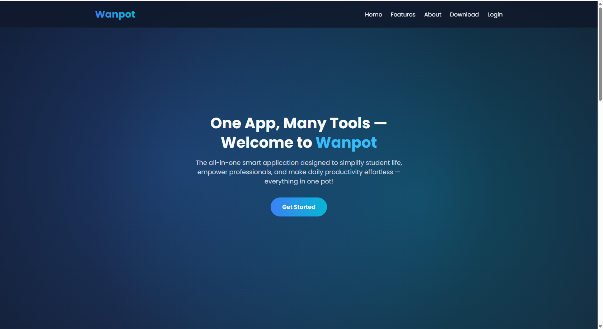

# Wanpot - All-in-One Smart App
<a href="https://wanpot.onrender.com">Project Demo</a>

 Wanpot is a unified, all-in-one workspace web application designed to provide users with an intelligent, user-friendly platform for managing tasks, communication, and productivity. It includes features such as authentication, user management, two-factor authentication, and more.



## Table of Contents

- [Features](#features)  
- [Tech Stack](#tech-stack)  
- [Project Structure](#project-structure)  
- [Installation](#installation)  
- [Environment Variables](#environment-variables)  
- [Running Locally](#running-locally)  
- [Scripts](#scripts)  
- [Contributing](#contributing)  
- [License](#license)  

---

## Features

- User authentication and registration  
- Password change & profile update  
- Two-Factor Authentication (2FA)  
- Login history and device tracking  
- Responsive UI for both desktop and mobile  
- Admin and user-specific FAQ pages  
- Secure handling of secrets and API keys  
- Dashboard for quick access to features  

---

## Tech Stack

- **Frontend:** HTML, CSS, EJS (Embedded JavaScript Templates)  
- **Backend:** Node.js, Express.js  
- **Database:** MongoDB   
- **Authentication:** JWT / Sessions  
- **Deployment:** Onrender 

---

## Project Structure
wanpot/
│
├─ node_modules/ # Node dependencies
├─ public/ # Static assets (CSS, JS, images)
├─ routes/ # Express route handlers
├─ views/ # EJS templates
│ ├─ login.ejs
│ ├─ signup.ejs
│ ├─ settings.ejs
│ └─ ...
├─ .env # Environment variables (not committed)
├─ app.js / server.js # Main application entry
├─ package.json # NPM dependencies & scripts
├─ package-lock.json
└─ README.md


## Installation

1. **Clone the repository**

```bash
git clone git@github.com:Johnblesson/Wanpot.git
cd Wanpot

npm install

touch .env file
PORT=3000
MONGODB_URI=your_mongodb_connection_string
SESSION_SECRET=your_session_secret
OPENAI_API_KEY=your_openai_api_key


npm run dev


Scripts
npm start - Start the server in production mode
npm run dev - Start the server with nodemon for development
npm test - Run tests (if applicable)